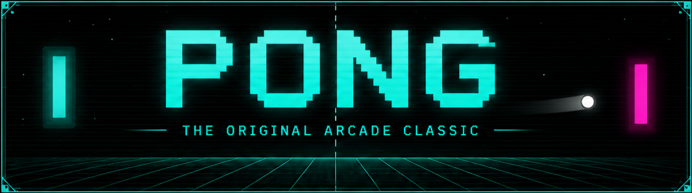

# Pong

A classic pong game built in C using [raylib](https://www.raylib.com/). Supports local 1v1, VS AI, particles, sound effects, and runs in the browser via WebAssembly.

## Play
🎮 [Play in browser](https://ruki0.itch.io/pong)

## Preview


## Features
- 1v1 local multiplayer
- VS AI opponent
- Particle effects on paddle hits and scoring
- Sound effects and music
- Runs natively on Linux and in the browser via WebAssembly
- Mobile touch controls in browser

## Controls

### Desktop
| Action | Player 1 | Player 2 |
|--------|----------|----------|
| Move Up | `W` | `↑` |
| Move Down | `S` | `↓` |
| Restart | `R` | `R` |


## Building

### Requirements
- GCC
- [raylib](https://github.com/raysan5/raylib) installed on your system

### Desktop (Linux)
```bash
cd build
./build.bash
./game
```

### Web (Emscripten)
```bash
cd build
./build_web.bash
```
Then serve the `build/web/` folder:
```bash
cd build/web
python3 -m http.server 8080
```
Open `http://localhost:8080` in your browser.

## Project Structure

## Project Structure

```
pong/
├── assets/
├── include/
│   ├── ball.h
│   ├── paddle.h
│   ├── particle.h
│   └── ui.h
├── src/
│   ├── ball.c
│   ├── main.c
│   ├── paddle.c
│   ├── particle.c
│   ├── ui.c
│   └── web_main.c
└── build/
    ├── build.bash
    └── build_web.bash
```


## Dependencies
- [raylib](https://www.raylib.com/) — graphics, audio, input
- [Emscripten](https://emscripten.org/) — web build only

## License
MIT