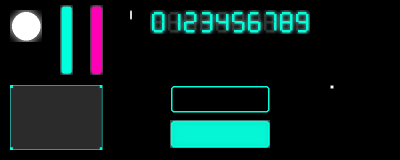

# Pong

A classic pong game built in C using [raylib](https://www.raylib.com/). Supports local 1v1, VS AI, particles, sound effects, and runs in the browser via WebAssembly.

## Play
🎮 [Play in browser](https://your-username.itch.io/pong)

## Preview


## Features
- 1v1 local multiplayer
- VS AI opponent
- Particle effects on paddle hits and scoring
- Sound effects and music
- Runs natively on Linux and in the browser via WebAssembly
- Mobile touch controls in browser

## Controls

### Desktop
| Action | Player 1 | Player 2 |
|--------|----------|----------|
| Move Up | `W` | `↑` |
| Move Down | `S` | `↓` |
| Restart | `R` | `R` |

### Mobile (browser)
Tap the left side of the screen to control Player 1, right side for Player 2. Tap the top half to move up, bottom half to move down.

## Building

### Requirements
- GCC
- [raylib](https://github.com/raysan5/raylib) installed on your system

### Desktop (Linux)
```bash
cd build
./build.bash
./game
```

### Web (Emscripten)
```bash
cd build
./build_web.bash
```
Then serve the `build/web/` folder:
```bash
cd build/web
python3 -m http.server 8080
```
Open `http://localhost:8080` in your browser.

## Project Structure